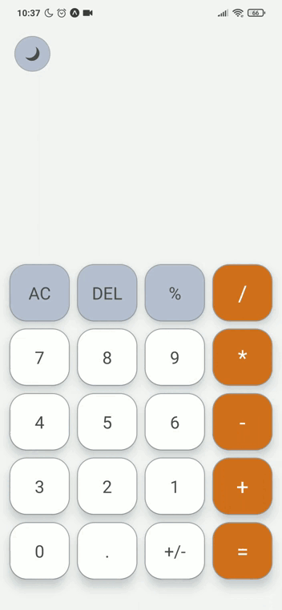

<h1 align="center"> Calculadora em React Native </h1>

  

   
  

<h2>🚀 Descrição</h2>

  
Calculadora desenvolvida em React Native, utilizando expo com modo ligth e dark.

<h2>🛠 Tecnologias</h2>

 Tecnologias utilizadas para a criação da aplicação

<u>
 <li>
  <a href='https://expo.dev/' target="_blank" rel="nofollow">Expo</a>
 </li>
</u>

<h2>🔥 Para Clonar o repositório</h2>

No terminal execute o seguinte código: 

 <pre>
 git clone https://github.com/rodrigomotamendes/calculator_rn
</pre>

<h2>🔥 Executando o projeto</h2>

Utilize o <b>yarn</b> ou o <b>npm install</b> para instalar as dependências do projeto.
Em seguida, inicie o projeto. 

<pre>
expo start
</pre>

<h2>💜 Autor</h2>

Projeto criado por <a href='https://www.linkedin.com/in/rodrigo-mota-mendes/' rel="nofollow">rodrigomotamendes</a>

